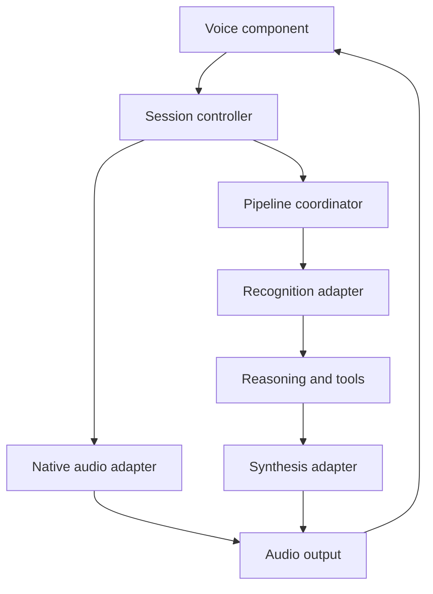

# JavaScript Voice Integrations and a Common Application Interface

**Documentation checked: 2026-09-06 (UTC).** Examples are original adaptations of public API contracts. No paid calls, microphone sessions, SDK installations, or production integration tests were performed for this study.

[Research](../README.md) · [Provider profiles](../providers.md) · [Proposed TypeScript contract](voice-contract.ts)

## What the examples demonstrate

There are three boundaries: synthesizing supplied text, operating a native audio conversation, and presenting that conversation in a browser. A reusable application can normalize these boundaries, but it cannot infer missing capabilities or safely pass one provider's wire format into another.

| Provider / model | Example | Export / configuration | Result and boundary |
| --- | --- | --- | --- |
| Cartesia Sonic 3.6 | [HTTP TTS](http-tts.mjs) | `cartesia()` | Complete transcript in; WAV bytes out. |
| Inworld TTS 2 | [SDK TTS](sdk-tts.mjs) | `inworldSpeech({ model: 'inworld-tts-2', ... })` | Async audio chunks; requires `@inworld/tts`. |
| Inworld TTS 2 Flash | [SDK TTS](sdk-tts.mjs) | `inworldSpeech()` | Same SDK route, distinct model and controls. |
| Speechify Simba 3.2 | [HTTP TTS](http-tts.mjs) | `speechify()` | Binary stream collected into bytes; English-only. |
| Speechify Simba 3.0 | [HTTP TTS](http-tts.mjs) | `speechify({ model: 'simba-3.0', language: 'pt-BR', ... })` | Requires a suitable 3.0 voice; supplemental language alternative. |
| Luna TTS | [Access boundary](#luna-access-boundary) | No fabricated wrapper | Provider contract must be supplied before implementation. |
| Breeze TTS 2 | [Local service](breeze-local.mjs) | `breezeLocal()` | Multipart reference/text input; local PCM stream. |
| Eleven v3 Conversational | [WebSocket TTS](websocket-tts.mjs) | `elevenLabsSpeech()` | Dialogue WebSocket; base64 MP3 audio. |
| Gemini 3.1 Flash TTS | [SDK TTS](sdk-tts.mjs) | `geminiSpeech()` | Interactions streaming audio; requires `@google/genai`. |
| Smallest Lightning v3.1 Pro | [HTTP TTS](http-tts.mjs) | `smallest()` | Explicit Pro model, Pro voice and WAV output. |
| Soniox TTS Realtime v2 | [WebSocket TTS](websocket-tts.mjs) | `sonioxSpeech()` | Identified text/audio stream; PCM16 output at 24 kHz. |
| MiniMax Speech 2.8 HD | [HTTP TTS](http-tts.mjs) | `minimax({ model: 'speech-2.8-hd', ... })` | One-shot JSON with hexadecimal MP3 bytes. |
| MiniMax Speech 2.8 Turbo | [HTTP TTS](http-tts.mjs) | `minimax()` | Same decoding, separate model. |
| Gradium TTS | [HTTP TTS](http-tts.mjs) | `gradium()` | Default model via REST, explicit binary WAV response. |
| Fish S2.1 Pro | [HTTP TTS](http-tts.mjs) | `fish()` | Model header plus voice reference; binary MP3. |
| Gemini 3.1 Flash Live | [Native sessions](native-sessions.mjs) | `geminiLive()` | Server-side bidirectional audio session. |
| GPT-Realtime-2.1 Mini / full | [Server](native-sessions.mjs), [browser](openai-browser.mjs) | `openAIClientSecret()`, `startVoice()` | Short-lived session credential, then SDK connection. |

Provider-specific evidence appears in code comments and the [source register](../sources.md). An export shows one verified request pattern; it is not a claim to implement all available transports for that provider.

## Run a single synthesis example

The repository's validation and ranking commands need **Node.js 22 or newer** and no installed packages. Most HTTP examples use the same runtime's built-in `fetch`. Optional packages are only needed for their corresponding examples.

From the repository root, first configure the relevant key and voice ID in your local environment. Keep them out of source control. This example performs a real, potentially billable synthesis request when you run it:

```js
// Save locally as try-speech.mjs at the repository root.
import { writeFile } from 'node:fs/promises';
import { cartesia } from './research/001-cost-vs-naturalness/integrations/http-tts.mjs';

const result = await cartesia({
  apiKey: process.env.CARTESIA_API_KEY,
  voiceId: process.env.CARTESIA_VOICE_ID,
  text: 'Please compare the timing and clarity of this short example.',
});
await writeFile('sample.wav', result.audio);
```

Choose a voice that belongs to the selected model and supports the required language. The files deliberately do not embed account-specific voice identifiers or provider secrets. For other providers, call the function in the table and supply its corresponding key/voice. Language option names follow the provider: `language`, `locale`, or `languageBoost`.

The HTTP helpers collect the response to make byte decoding easy to inspect. Although several endpoints stream on the network, these helpers do not play audio before completion. A realtime adapter should read `response.body` incrementally and maintain a bounded output queue.

For SDK/WebSocket examples, install only the dependencies needed by the host application:

```bash
npm install --no-save ws
# Inworld SDK example:
npm install --no-save @inworld/tts
# Google SDK examples:
npm install --no-save @google/genai
# OpenAI browser example, in a browser application's bundler project:
npm install @openai/agents
```

These commands intentionally do not claim a tested dependency lockfile. The research collection itself has no production application dependencies. Pin and test compatible versions in the application consuming the examples before deployment.

## Streaming examples

The Soniox and ElevenLabs functions accept `onAudio` and an optional abort signal. Each sends one complete text response and waits for its provider-specific completion event. A callback receives PCM for Soniox and MP3 bytes for ElevenLabs; it must not assume they share an encoding.

```js
import { writeFile } from 'node:fs/promises';
import { elevenLabsSpeech } from './research/001-cost-vs-naturalness/integrations/websocket-tts.mjs';

const chunks = [];
await elevenLabsSpeech({
  text: 'This example collects a complete response before saving it.',
  apiKey: process.env.ELEVENLABS_API_KEY,
  voiceId: process.env.ELEVENLABS_VOICE_ID,
  onAudio: chunk => chunks.push(chunk),
});
await writeFile('sample.mp3', Buffer.concat(chunks));
```

The helper rejects a connection that closes before completion. Timeout and abort handling prevent indefinite waits. A production session additionally needs incremental text input, flow control, keepalive, session reuse, retry policies, and explicit upstream cancellation. Closing a connection does not guarantee that already-produced audio is unbilled.

For Inworld, the generator yields WAV chunks in the documented SDK mode. For Google TTS, it yields raw audio with encoding/sample-rate metadata. The SDK examples do not implement provider cancellation or production retry behavior. Breaking out of a generator is not presented as verified cancellation of billable remote work.

## Native audio sessions

The OpenAI server export creates a short-lived credential. The host application must expose it through an authenticated `POST /api/voice-token` route, limit which models can be selected, and apply its session budget. The browser export invokes that route and returns a session plus `stop()`. Call it from a user action and close it when the session or component ends. It does not include a complete web server or front-end application. [WebRTC setup](https://developers.openai.com/api/docs/guides/realtime-webrtc).

The Gemini export demonstrates a server connection, PCM input messages, output events, and interruption notification. The caller supplies already-resampled 16 kHz PCM16 input and handles 24 kHz output. It must implement transport from the browser and local playback. Browser-direct access requires the documented short-lived-token flow; this example does not expose a backend API key to a client. [Google SDK setup](https://ai.google.dev/gemini-api/docs/live-api/get-started-sdk).

A browser `MediaStream` is not automatically PCM16 bytes. Capture, resampling, framing, and output playback are separate work. `getUserMedia` requires permission and a suitable secure context; AudioWorklet can host low-latency audio processing. [Microphone API](https://developer.mozilla.org/en-US/docs/Web/API/MediaDevices/getUserMedia), [AudioWorklet](https://developer.mozilla.org/en-US/docs/Web/API/AudioWorklet).

## A provider-independent component boundary

The [TypeScript contract](voice-contract.ts) is a proposed application design. It intentionally distinguishes `SpeechSynthesizer` from `ConversationSession` so a UI cannot mistake a speech-output function for an agent that understands microphone input.



This diagram describes a general integration pattern. It is not a prebuilt implementation. In a pipeline, the coordinator owns conversation state and invokes the synthesis adapter only after choosing the text. In a native session, provider-specific events determine how the controller sees the conversation.

The component should receive an adapter or controller object from its host. It can react to audio, transcript, error, usage and lifecycle events without storing a provider secret. A public API can be small while each adapter implements substantial transport and lifecycle logic behind it.

| Concern | Common interface responsibility | Provider adapter responsibility |
| --- | --- | --- |
| Model selection | Stable configured provider/model identity | Exact selector, supported voices and model-version validation |
| Authentication | Request an authorized session | Server secret, ephemeral token or signed session mechanism |
| Audio | Carry bytes with format metadata | Decode binary, base64, hex, MessagePack, or media tracks |
| Language | Express the requested locale and validate availability | Map to the model/voice's supported configuration |
| Expression | Expose only supported controls | Map steering, tags or parameters without silently promising equivalence |
| Interruption | Invalidate the active generation and clear playback | Cancel generation or isolate/close the upstream stream as supported |
| Usage | Preserve quantities and units | Translate provider counters without pretending they are all characters or seconds |
| Failure | Surface classified errors and recovery state | Interpret HTTP errors, application errors and transport closure |

### Cancellation and playback correctness

Use a generation ID for every reply. When interrupted, stop or invalidate upstream generation, clear local queued audio, and discard late chunks belonging to the old generation. Track the played portion separately from the generated portion when reconciling conversation history. A `generation-ended` event means no more output is expected; it does not mean the speaker has finished playing the queued audio.

For a WebRTC SDK that owns microphone and speaker tracks, the host may need a transport-specific media integration rather than forcing the session into the PCM-oriented interface unchanged. The contract is an illustrative boundary, not proof that the supplied SDK session already conforms to it.

### What prevents universal interchangeability

Provider state, buffering thresholds, supported interruptions, native tool execution, audio formats, voice identity, pronunciation controls, and billing semantics are different. A fallback can change the speaker, require resampling, restart a conversation, or lose unsupported controls. It should be an explicit, tested transition with a clear client state.

Adding a new provider therefore means implementing and testing an adapter, not merely accepting an arbitrary model name. Prefer a capability check and a clear unsupported-feature error over silently dropping an essential behavior.

## Breeze local runtime

Start the documented Python service and load the required model before calling [breezeLocal()](breeze-local.mjs). Supply an authorized reference-audio Blob and its transcript. The response is PCM16 at 24 kHz, not a WAV file; it needs framing or an appropriate player. The local endpoint is not a hosted provider service and the model's separate use restrictions still apply. [Model and server documentation](https://huggingface.co/BreezeBlue/Breeze-TTS-2).

## Luna access boundary

The public material reviewed does not provide enough verified detail for an executable Luna adapter. A vendor-supplied base URL, model/voice contract, output encoding, completion events, authentication details, and tariff are prerequisites. No endpoint or model selector has been invented for this study. [Official site](https://www.vuilabs.ai/), [Research report](https://arxiv.org/html/2608.11593v1).

## Validation status

JavaScript syntax, internal references, local calculations and repository consistency are checked by the harness. Provider behavior is documentation-reviewed only. The optional SDKs were not installed or type-checked as packages, and the TypeScript file is a design contract, not a working runtime implementation. Before shipping, test credentials, model access, voice compatibility, streaming, lifecycle cleanup, interruption, actual usage, and supported languages against the real service.
