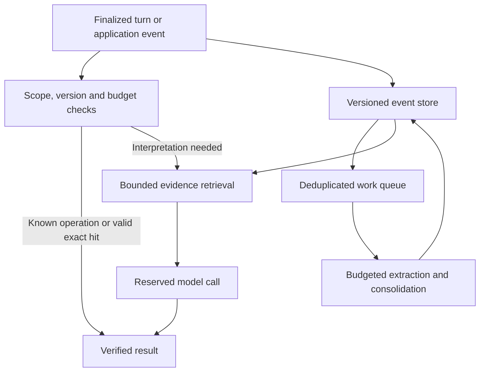

# AI Voice Engineering: Deterministic Memory Controls for Lower LLM Cost

**Research date:** 2026-09-06 (UTC)

**Evidence checked:** 2026-09-06 (UTC)

**Study:** 002 · Literature review, engineering proposal and reproducible arithmetic experiment

**Audience:** Engineers designing conversational voice applications with persistent memory

> Deterministic software can decide when an application is allowed to spend inference resources, which evidence is eligible, and how much work may run. Research supports many components of this approach. It does not establish a universal saving for their combination, and a smaller LLM bill is insufficient if memory quality, task completion or conversation latency deteriorate.

[Collection index](../../README.md) · [Source register and evidence gaps](sources.md) · [Experiment inputs](data/scenarios.json) · [Cost model](experiments/cost-model.mjs) · [Evaluation protocol](evaluation.md)

## Research question and answer

**Can a deterministic memory layer act as a boundary around probabilistic inference, reducing paid LLM work while retaining useful conversational memory?** Yes, as an architectural approach worth testing. The strongest case is to execute operations with explicit semantics in ordinary code: permission checks, exact lookups, version comparisons, deduplication, arithmetic, bounded retrieval and resource admission. Use learned interpretation where the meaning of an utterance remains uncertain.

There is substantial prior art. FrugalGPT and RouteLLM allocate queries across models; Palimpzest applies query planning to AI operations; TReMu combines temporal memory with executable reasoning. These establish related mechanisms under specific experimental conditions. They do not validate this study's proposed system or imply that all its parts are deterministic. [FrugalGPT](https://arxiv.org/html/2305.05176v1), [RouteLLM](https://arxiv.org/html/2406.18665v4), [Palimpzest](https://www.vldb.org/cidrdb/papers/2025/p12-liu.pdf), [TReMu](https://arxiv.org/html/2502.01630v2).

The proposed improvement is a **small, measurable control layer**, with increasingly expensive memory operations admitted only when their expected benefit justifies their cost. Preserve source evidence, introduce budgets before adding autonomous loops, and compare every extra mechanism against a simpler baseline. This is an engineering inference from the reviewed evidence, not a claim of novelty or measured production performance.

The proposed architecture and arithmetic experiment use generic examples and hypothetical workloads and prices. Published provider terms and external results are identified with sources. No proprietary implementation, private dataset or unpublished product result is described.

## What counts as deterministic?

Here, deterministic means that a policy produces the same decision given the same explicit inputs, configuration and state snapshot. It does not mean zero computation, perfect information, immunity to bugs, or identical behavior under concurrent state changes.

| Operation | Deterministic part | Learned or uncertain part |
| --- | --- | --- |
| Budget admission | Compare an atomic reservation with a configured allowance | Future usage, model pricing accuracy and unreported charges |
| Exact response reuse | Compare every required key/version and expiration | Whether the key includes all relevant conversational state |
| Semantic response reuse | Apply metadata predicates and a threshold | Embeddings, relevance estimates and semantic equivalence |
| Memory retrieval | Enforce scope, dates, limits and stable tie-breaking | Query interpretation, embeddings, reranking and inferred dates |
| Memory update | Validate schema, provenance and versions; commit a transaction | Extracting facts and deciding whether statements contradict |
| Temporal reasoning | Calculate differences between validated dates | Resolving “last Friday,” time zones and ambiguous event references |
| Turn control | Check event IDs, revision numbers and cancellation state | Speech recognition, speaker identification and semantic endpointing |
| Prompt reduction | Remove exact duplicates and fields declared irrelevant | Summarization and learned prompt compression |

An embedding model is still a learned model even when a pinned implementation returns repeatable vectors. A cosine threshold is deterministic arithmetic applied to an uncertain representation. Likewise, a language model selecting `ADD`, `UPDATE` or `DELETE` is probabilistic interpretation surrounded by deterministic execution. Mem0 explicitly uses model calls for its extraction and update stages. [Mem0, methods](https://arxiv.org/html/2504.19413v1).

For tightly constrained messages, standard application logic can also replace generation altogether. OpenAI's latency guide describes fixed confirmations, precomputed responses and conventional data structures as useful alternatives, and distinguishes fewer requests from faster generation. Its latency heuristics are guidance, not guarantees for a particular voice workload. [OpenAI latency optimization](https://developers.openai.com/api/docs/guides/latency-optimization).

## What the research actually establishes

These are source-reported experiments, not tests run by this collection. Percentages, ratios and scores have different denominators and must not be combined into a cross-paper ranking.

| Work and evidence type | Relevant finding | What it does not establish |
| --- | --- | --- |
| [FrugalGPT, 2023 paper](https://arxiv.org/html/2305.05176v1) | Table 3 reports matched-accuracy savings of 98.3% on HEADLINES, 73.3% on OVERRULING and 59.2% on COQA, using historical APIs/prices. | These are learned cascades with scoring and training costs; sequential fallback may increase latency. No voice evaluation. |
| [RouteLLM, v4](https://arxiv.org/html/2406.18665v4) | Table 6 reports a 3.66× cost-saving ratio at 95% GPT-4 quality on MT Bench, using GPT-4-1106-preview and Mixtral-8x7B. | A learned router is not a rule-based proof of answer quality. Workload shift and training-data coverage matter. |
| [Palimpzest, CIDR 2025](https://www.vldb.org/cidrdb/papers/2025/p12-liu.pdf) | Its optimizer can move cheap/selective filters before expensive conversions while respecting dependencies. | Analytics workloads do not establish conversational savings. Learned estimates and generated replacement code remain part of the system. |
| [TReMu, ACL Findings 2025](https://arxiv.org/html/2502.01630v2) | Timeline memory plus symbolic execution improves temporal reasoning in a controlled dialogue benchmark. | Quality improvement does not prove lower dollar cost; interpretation and code generation still use models. |
| [MemGPT, v2](https://arxiv.org/html/2310.08560v2) | Persistent storage and paging improve retrieval beyond a constrained prompt. Its DMR GPT-4 Turbo result rises from 35.3% to 93.4% against a recursive-summary baseline. | That comparator is not full-history prompting. LLM-controlled paging can create additional calls and stop incorrectly. |
| [Mem0, vendor paper](https://arxiv.org/html/2504.19413v1) | Selected memory greatly reduces query context and response latency against full history. | Its full-history baseline has higher overall judge quality; ingestion and lifetime spend must be considered separately. |
| [Zep, vendor paper](https://arxiv.org/html/2501.13956v1) | On LongMemEval-S with GPT-4o, its reported score is 71.2% versus 60.2% full-context, with roughly 1.6K versus 115K context tokens. | Category regressions and ingestion expense remain; this is a different benchmark from Mem0's comparison. |
| [LongMemEval, ICLR 2025](https://arxiv.org/html/2410.10813v2) | Raw text plus extracted facts outperforms fact-only indexing in an important retrieval ablation. | A compressed memory representation alone is not sufficient evidence that useful detail survives. |
| [LLMLingua, EMNLP 2023](https://arxiv.org/html/2310.05736v2) | GSM8K uses 117 versus 2,366 tokens at 77.33 versus 78.85 exact match; roughly 20× compression. | BBH drops from 70.07 to 56.85 at roughly 7× compression. Token reduction is not equal to total bill reduction. |
| [GPTCache, NLP-OSS 2023](https://aclanthology.org/2023.nlposs-1.24/) | A 1,000-query experiment reports 876 cache hits, including 39 incorrect hits. | A fast hit is not necessarily a correct answer. This experiment uses sentence pairs, not an evolving voice conversation. |
| [vCache, v5](https://arxiv.org/html/2502.03771v5) | In 45,000 classification prompts, correct and incorrect hits have overlapping similarity distributions; mean scores are 0.84 and 0.85. | One universal similarity threshold is unreliable. Its guarantees depend on assumptions and reference-model agreement, not factual truth. |
| [Sleep-time Compute, 2025](https://arxiv.org/html/2504.13171v1) | Preprocessing can reduce later reasoning work when related questions reuse the same context. | Its up-to-2.5× average cost result assumes ten queries per context and test-time generated tokens priced at ten times sleep-time tokens. |

### A concrete memory trade-off

Mem0's Table 2 reports the following on its LoCoMo evaluation, excluding adversarial questions:

| Configuration | Retrieved/context tokens | p95 response latency | LLM-judge score |
| --- | --- | --- | --- |
| Full context | 26,031 | 17.117 s | 72.90% |
| Mem0 | 1,764 | 1.440 s | 66.88% |
| Mem0 with graph | 3,616 | 2.590 s | 68.44% |

The graph increases overall score by 1.56 percentage points over base memory while increasing tokens and latency; its single-hop and multi-hop scores are lower than the base variant. These are vendor-authored measurements. Context counts are not a complete accounting of extraction, updates, retries or infrastructure. [Mem0, Tables 1–2](https://arxiv.org/html/2504.19413v1).

Zep reports a different outcome against long full-context histories, but also a GPT-4o single-session-assistant regression from 94.6% to 80.4%. Its short DMR comparison is nearly tied for GPT-4o-mini, 98.0% versus 98.2%. **The benefit depends on the workload and baseline.** [Zep, evaluation](https://arxiv.org/html/2501.13956v1).

A Letta report provides a useful counter-baseline using conversation files and tools. Its setup includes embeddings and agent-directed search; describing it as “just grep” or “zero-model memory” would be misleading. This is another vendor report, not a neutral replication establishing a winner. [Letta filesystem memory evaluation](https://www.letta.com/blog/benchmarking-ai-agent-memory/).

### Direct precedent for combining code and inference

TReMu evaluates 600 temporal multiple-choice questions derived from multi-session dialogues, including 112 unanswerable questions. With GPT-4o, timeline memory plus chain-of-thought achieves 71.50%; the full method reaches 77.67%, a 6.17-point gain. With GPT-4o-mini, the corresponding gain is only 1.50 points. The system uses LLM interpretation and generated Python, followed by execution and answer selection. This supports separating precise temporal computation from natural-language interpretation; it does not establish a cost saving. [TReMu, Tables 5–6](https://arxiv.org/html/2502.01630v2).

For the hypothetical design below, prefer reviewed, fixed date and arithmetic functions when their input schema is known. If code generation is necessary, count its model calls and isolate execution. A deterministic calculation can be exactly wrong when supplied an incorrectly extracted date.

## Five distinct ways to save

| Mechanism | What is avoided or discounted | Cost that remains |
| --- | --- | --- |
| Rule-based bypass | An otherwise unnecessary generation, such as an exact UI action confirmation | Policy evaluation and possibly speech playback/synthesis |
| Exact answer cache | New generation for the same validated state | Lookup, invalidation, storage and any requested speech |
| Semantic answer cache | New generation for an accepted meaning-equivalent request | Embeddings, equivalence checks, false-hit handling and refresh |
| Provider prefix cache | Reprocessing some identical input tokens at full price | New output generation, noncached input, writes and other charges |
| Selective memory | Sending irrelevant history on each model call | Ingestion, retrieval, derived views, generation and maintenance |

These mechanisms overlap. Apply their probabilities conditionally, then price the remaining operations. Do not add their headline savings percentages.

Prefix caching also has write economics. On the reviewed Claude documentation, standard five-minute writes cost 1.25× base input, one-hour writes 2×, and reads 0.1×, with model exceptions. For OpenAI, current documentation distinguishes newer models with explicit write charges from earlier models without that surcharge. **Pin the actual model and pricing contract.** [Claude prompt caching](https://platform.claude.com/docs/en/build-with-claude/prompt-caching), [OpenAI prompt caching](https://developers.openai.com/api/docs/guides/prompt-caching).

Cache validity is a separate question from cache price. TTL checks expiration; it does not establish that a remembered fact, permission or source version is still valid. RedisVL exposes expiration, metadata filters and similarity thresholds, which can support this policy but cannot independently prove answer correctness. [RedisVL SemanticCache API](https://redis.io/docs/latest/develop/ai/redisvl/0.17.0/api/cache/).

In GPTCache's cited experiment, incorrect reuse is 39/1,000 = 3.9% of requests but 39/876 ≈ 4.45% of served hits. Track both denominators. vCache's error formulation also requires careful denominator interpretation; an LLM judge added to verify reuse is another inference cost, even if evaluated asynchronously. [GPTCache paper](https://aclanthology.org/2023.nlposs-1.24/), [vCache](https://arxiv.org/html/2502.03771v5).

## Hypothetical architecture: a memory control layer

This section is a **proposed design** assembled from public patterns. It has not been deployed or benchmarked. The initial hypothetical baseline already stores conversation events, keeps derived facts, retrieves relevant memory and performs background consolidation. Its weakness is that every turn can trigger each stage without an explicit necessity test, work limit or reuse policy.

The improvement is to make resource admission and evidence eligibility explicit across both the foreground and background paths.



The event store is a source of evidence. Derived facts, summaries, embeddings and graphs are replaceable views. The diagram omits authentication transport, deployment topology and implementation-specific queues; it describes responsibility boundaries.

### Admission before expensive work

1. Resolve the authenticated scope and a stable turn/event identifier.
2. Reject duplicate transport events without duplicating side effects. A new intentional utterance with identical text is a new event.
3. Execute an allowlisted operation if the application already knows its semantics and required state.
4. Reuse a response only when scope, complete relevant state, source revisions, model/prompt policy, locale and expiry satisfy its validity contract.
5. Retrieve a bounded evidence set if interpretation still requires inference.
6. Estimate maximum request cost, reserve budget atomically, and dispatch within enforced output, duration and tool-call limits.
7. Reconcile actual usage and retain an auditable result. Treat an ambiguous timeout as potentially billable until resolved.

Do not infer “no memory needed” from a short sentence alone: “What about tomorrow?” may depend on several prior turns. Prefer explicit UI states and validated application events for the first bypasses. Semantic classification is an optional later stage whose error and cost need measurement.

LiteLLM documents request-cost reservation before dispatch and reconciliation afterward. It also documents limits: some audio routes cannot reserve token-based cost, and batch submission cannot estimate all contents from a file ID. A voice application therefore needs an explicit duration/usage reservation strategy; a dashboard showing previous spend is not a universal spending ceiling. [LiteLLM budget reservation](https://docs.litellm.ai/docs/proxy/users).

### Memory eligibility and provenance

A useful proposed record contains: scope, subject, predicate, value, source-event ID, original excerpt reference, observation time, valid-time interval, revision, extraction method, and deletion/supersession state. These fields have different jobs:

- **Scope** limits whose evidence can be retrieved; derive it from authenticated context.
- **Source links** let an answer or correction be traced to the original statement.
- **Observation time** records when the system learned a claim; valid time records when it applies.
- **Revision and supersession** distinguish a corrected fact from a second independent observation.
- **Extraction method** separates explicit structured input from model-inferred information.

Keep unresolved contradictions visible; recency alone should not silently decide every conflict. Repeated generation of the same statement is not independent corroboration. Store uncertainty as part of the evidence and permit abstention when the source does not answer the question.

LongMemEval has 500 questions across retrieval, multi-session reasoning, updates, temporal reasoning and abstention. In its long-history, round-level GPT-4o top-10 ablation, raw keys score 67.0%, fact-only 66.4%, and raw-plus-facts 72.0%. Its time filtering uses LLM-inferred bounds: the filtering operation is deterministic, while interpreting the bounds is not. This favors retaining raw evidence alongside concise views, subject to the application's retention policy. [LongMemEval](https://arxiv.org/html/2410.10813v2).

### Bounded retrieval before autonomous search

Start with explicit IDs, validated dates, exact fields and lexical retrieval where appropriate. Add semantic retrieval for paraphrases, and a reranker only if its improvement pays for its latency and inference. Proposed bounds should cover candidate count, source diversity, graph depth, query count, deadline and the final serialized token count.

Pack the recent conversational exchange needed to resolve references, a small set of current facts, and relevant source excerpts. Count the entire provider request with a compatible tokenizer, including instructions and tools; `characters / 4` is not a hard token limit. If necessary evidence does not fit, surface that limitation or take a budgeted fallback rather than silently declaring the answer well grounded.

Historical experiments in *Lost in the Middle* show that evidence position can substantially affect retrieval use. This motivates testing context ordering and distractor density, but does not establish that current models have the same position sensitivity. [Lost in the Middle](https://aclanthology.org/2024.tacl-1.9/).

### Background work must earn its reuse

Persist finalized events cheaply, but admit model extraction only when a configured policy calls for it. Possible triggers include a confirmed structured fact, a sufficiently large unprocessed event range, an explicit correction, or a scheduled consolidation boundary. These are proposed policy choices, not validated optimal thresholds.

Use stable identities for work over an event range and extraction version. Coalesce pending work, and track the latest source revision so a job cannot permanently miss an update that arrives while it is running. BullMQ documents deduplication modes, including preserving the latest pending data when a job is active. [BullMQ deduplication](https://docs.bullmq.io/guide/jobs/deduplication).

Queue deduplication is not end-to-end exactly-once billing. Removed job IDs can be reused, and retries must have idempotent application effects. A provider can finish a paid request before a worker crashes while saving its result. Persist job intent/result state, reconcile uncertain attempts, and cap retries. [BullMQ job IDs](https://docs.bullmq.io/guide/jobs/job-ids), [idempotent jobs](https://docs.bullmq.io/patterns/idempotent-jobs).

Asynchronous processing changes when users wait. It saves money only through skipped work, reuse, better pricing or smaller later calls. Sleep-time Compute explicitly demonstrates the importance of amortization assumptions; its reported cost multiplier should not be imported as an API discount. [Sleep-time Compute](https://arxiv.org/html/2504.13171v1).

For nonurgent supported requests, OpenAI's Batch API advertises a 50% discount and a turnaround of up to 24 hours. It is potentially useful for evaluation or delayed extraction, but does not suit a memory correction needed on the next spoken turn. Verify model and endpoint support. [OpenAI Batch API](https://developers.openai.com/api/docs/guides/batch).

### Graphs should be optional and task-justified

A bounded traversal over existing relationships can be ordinary deterministic retrieval. Constructing those relationships from conversation may require uncertain, paid extraction. Microsoft GraphRAG additionally builds LLM-derived reports; its global search uses map/reduce generation over those reports. That is a different cost profile from a simple graph lookup. [GraphRAG indexing](https://microsoft.github.io/graphrag/index/overview/), [global search](https://microsoft.github.io/graphrag/query/global_search/).

The original GraphRAG work addresses query-focused summarization across document collections. That is relevant prior art, but is not a demonstration that global graph summarization should run during every conversational turn. [GraphRAG paper](https://arxiv.org/html/2404.16130v2).

For the hypothetical layer, require a graph ablation against scoped raw-event and vector retrieval. Add edges only for recurring relationship questions whose improvement exceeds extraction, maintenance and traversal cost. A graph database, relational database or file store is an implementation choice; none eliminates inference expenditure by itself.

## Improvement priorities for the hypothetical baseline

The order below is an **engineering recommendation for experiments**, not an evidence-backed universal ranking.

| Priority | Baseline behavior to improve | Proposed change | Measurement that justifies keeping it |
| --- | --- | --- | --- |
| 1 | Only final generation is billed to the feature | Attribute every model, embedding, retry, worker and speech charge to a turn/task | Reconciled lifecycle cost and missing-usage rate |
| 2 | Duplicate events can start duplicate work | Event identity, idempotent effects, bounded retries and work coalescing | Duplicate billed attempts and unresolved attempts |
| 3 | Known application operations invoke a model | Allowlisted deterministic handlers | Bypass precision, completion rate and saved generation calls |
| 4 | Every prompt includes a large memory payload | Scoped retrieval, source preservation and serialized token budgets | Recall, answer quality, prompt size and p95 turn latency |
| 5 | Exact reuse ignores changing state | Complete cache keys with version/permission validation | Correct-hit rate, invalidation lag and lookup overhead |
| 6 | Frequent rewrites destroy prefix reuse | Stable instructions and planned memory refresh boundaries | Actual cached-input tokens, cache writes and total spend |
| 7 | Every turn rebuilds derived memory | Incremental extraction with admission rules and reuse thresholds | Worker cost per useful memory and reuse before invalidation |
| 8 | Every query uses a large generator | Calibrated model routing with bounded fallback | Cost per successful task and category-specific quality |
| 9 | Semantic reuse is enabled globally | Restrict to evaluated request classes with explicit uncertainty limits | Wrong reuse per request and per served hit |
| 10 | Graph expansion and compression run automatically | Optional features justified through ablation | Marginal quality gain versus marginal full-lifecycle cost |

A hard policy boundary must remain outside the model. The model may propose a tool or memory update; application code validates the operation and its resource allowance. “Use fewer tokens” inside a prompt is guidance, not an admission controller.

## Cost equations and break-even conditions

The following equations are **analytical models**, not measured results. Use the provider's actual units and avoid charging the same tokens twice.

For one model call, with rates per million tokens:

```text
C_call = (T_uncached × P_input
        + T_cache_read × P_read
        + T_cache_write × P_write
        + T_output × P_output) / 1,000,000
        + C_other_billable_items
```

Token categories must be disjoint. Reasoning, audio, tool use and non-token charges belong in the categories specified by the provider's billing contract.

For an observation window:

```text
C_total = C_foreground_generation + C_routing + C_retrieval
        + C_embeddings + C_extraction + C_consolidation
        + C_cache_operations + C_retries_and_uncertain_attempts
        + C_storage_and_compute + C_speech + C_other_operations
```

Break out operational labor or disclose it as excluded. Locally hosted models replace vendor API expenditure with compute and operations; zero API price is not zero total cost.

### Conditional bypass and cache hits

Let `b` be the fraction of turns handled without generation, and `h` the fraction of the remaining turns served by valid exact hits. Then:

```text
generation_fraction = (1 − b) × (1 − h)
```

With `b = 0.15` and `h = 0.10`, 76.5% of turns generate a response. The avoided fraction is 23.5%, not 25%. Calling this “100% accurate bypass” would require evaluation; these are merely scenario inputs.

### When does precomputation pay?

Let `W` be the cost of building/refreshing a derived memory view, `B` the per-query cost without it, and `R` the per-query cost using it, including retrieval. For `n` reuses before invalidation:

```text
W + n × R < n × B
n > W / (B − R), provided B > R
```

If a hypothetical view costs $0.04 to build and saves $0.003 per use, it needs at least 14 uses before refresh to pay back. If it is used twice and then invalidated, its asynchronous execution has not made it economical.

### When does a prefix-cache write pay?

For a prefix that would otherwise cost `K` each time, one write multiplier `w` and `n` subsequent reads at multiplier `r` cost `(w + n × r)K`. Without caching, cost is `(1 + n)K`:

```text
n > (w − 1) / (1 − r), for r < 1
```

At `w = 1.25, r = 0.1`, one subsequent hit pays back the write premium. At `w = 2, r = 0.1`, two hits are needed. This applies only to the same reusable prefix before expiration; outputs and unrelated input are unaffected. See the model-specific terms above.

### When does a router or cascade pay?

For pre-generation routing with overhead `Q`, a small-model share `s`, small cost `S` and large cost `L`, expected generation-path cost is `Q + sS + (1 − s)L`. Savings require `Q < s(L − S)` before quality constraints and fallback overhead.

A sequential small-then-large cascade instead costs `S + (1 − a)L`, where `a` is the small model's accepted fraction. Both calls are billed on fallback; savings require `S < aL` before scorer/retry costs. Do not price a cascade as though it only runs its final model. RouteLLM's pre-generation routing and FrugalGPT's cascades motivate this distinction. [RouteLLM](https://arxiv.org/html/2406.18665v4), [FrugalGPT](https://arxiv.org/html/2305.05176v1).

## Reproducible arithmetic experiment

**No LLM was called and no conversation was recorded.** This experiment executes a transparent cost model with invented inputs. It demonstrates accounting and sensitivity, not achieved quality, hit rates, latency or expected savings.

All scenarios contain 1,000 turns. Large-model rates are hypothetically $2/M input and $8/M output; small-model rates are $0.30/M and $1.20/M. Generated answers have 200 output tokens. Speech is held at **$11 for the entire window**, representing an arbitrary fixed allowance that isolates non-speech mechanisms. It is not a provider quote or a cost per minute.

The full-history baseline sends 4,000 input tokens per generation. Bounded-memory scenarios send 1,200, allocate $0.0001 per turn for policy checks, $0.00015 per generated response for retrieval, $0.40 to aggregate background work, and $0.20 to additional infrastructure. Background includes hypothetical extraction, embeddings, indexing, consolidation and their retries. Exact-cache lookup costs $0.00002 after bypass. The routed scenario adds $0.00008 per remaining generation decision and sends 60% to the small model.

The prefix-cache-only scenario retains the full input: 3,000 cacheable tokens, 90% reads at 0.1× input price and 10% writes at 1.25×. This is an assumed warm/cold mix, not an achieved cache rate. The excessive-work scenario raises background spend to $7 and infrastructure to $1 without improving the modeled response path.

<!-- COST_TABLE_START -->
| Hypothetical scenario | Generation calls | Non-speech cost (USD) | Total with fixed speech (USD) | Non-speech saving | Total saving |
| --- | --- | --- | --- | --- | --- |
| Full history | 1000 | 9.6000 | 20.6000 | 0.0% | 0.0% |
| Full history plus prefix cache | 1000 | 4.8900 | 15.8900 | 49.1% | 22.9% |
| Bounded memory | 1000 | 4.8500 | 15.8500 | 49.5% | 23.1% |
| Memory plus exact gates | 765 | 3.8918 | 14.8918 | 59.5% | 27.7% |
| Gates plus learned routing | 765 | 2.3924 | 13.3924 | 75.1% | 35.0% |
| Excessive background work | 1000 | 12.2500 | 23.2500 | -27.6% | -12.9% |
<!-- COST_TABLE_END -->

**Interpretation:** A large non-speech saving becomes a smaller total saving when speech remains unchanged. Eager background processing can make the system more expensive. Prefix caching alone is a necessary comparator: under these assumptions it nearly matches bounded memory. These results cannot establish which configuration preserves acceptable conversational quality.

The model omits foreground retries, cascading failures, quality-related rework, and operational labor. These omissions favor successful scenarios; add them before making a deployment decision. Generation-call counts exclude background work and any learned router calls. A lower call count is not evidence that fewer tasks were dropped.

Run from the repository root with Node.js 22 or newer:

```bash
node scripts/memory-cost.mjs
node scripts/validate.mjs
```

Edit [the explicit scenario inputs](data/scenarios.json), then regenerate the table with `node scripts/memory-cost.mjs --write`. The validator checks the table against the calculation and exercises conditional hit rates, cache-write premiums, costs that survive full bypass, invalid inputs, and the unfavorable scenario. Changes to published assumptions also require reviewing the independently calculated reference values in `scripts/validate-memory-cost.mjs`. The code implements the arithmetic, not a running memory service.

## Voice-specific implications

A voice application introduces costs and correctness conditions beyond text memory. The following are proposed checks for the architecture:

- **Finalization:** Do not extract durable facts from every partial transcript. Track finalized source revisions and corrections without conflating transport duplication with a repeated intentional utterance.
- **Interruption:** Stop playback, cancel pending generation where supported, and prevent superseded work from being presented. An abort does not imply that already processed tokens will be refunded.
- **Freshness:** Keep recent conversational context available while slower derived views catch up. A background worker should not hide a correction the user just made.
- **Audio identity:** If caching synthesized output, key voice, model version, locale, speaking style and output format as well as text. Evaluate repetition and prosody before assuming cached speech feels natural.
- **Separate bills:** STT, native audio input, TTS/audio output, text reasoning and telephony can be charged differently. A saved text-model call need not remove the speech bill.

OpenAI's Realtime documentation warns that changing earlier history or instructions reduces prefix-cache reuse, and that frequent truncation can repeatedly invalidate it. It exposes context-window and retention controls, with an explicit memory-quality trade-off. This supports testing planned compaction boundaries against frequent small edits. [Realtime cost management](https://developers.openai.com/api/docs/guides/realtime-costs).

The VAD API exposes response and interruption controls; semantic VAD uses a learned classifier to estimate whether the speaker has finished. Therefore, a threshold in endpointing configuration does not make the complete audio pipeline deterministic. [Realtime VAD](https://developers.openai.com/api/docs/guides/realtime-vad).

Native audio systems and STT–LLM–TTS pipelines may expose different control points. Evaluate a selected provider's actual event contract before assuming that a universal memory adapter can prevent every unwanted response.

## How to test the proposal fairly

Use the [evaluation protocol](evaluation.md) before any savings claim. The central comparison is **cost per successfully completed, grounded task**, with a fixed quality floor and acceptable voice latency. Run a baseline matrix that includes full history, a recent window, raw-event retrieval, prefix caching, bounded memory, optional exact reuse and optional learned routing. Test graphs and compression separately.

LoCoMo's published ACL 2024 version contains ten conversations and 1,986 questions, including adversarial cases. Later versions and downstream exclusions differ. Pin dataset and grader versions, record exclusions, and include updates, temporal relationships, speaker attribution and abstention. Its synthetic/human-edited text conversations do not establish Portuguese or audio performance. [LoCoMo](https://aclanthology.org/2024.acl-long.747/).

The evaluation protocol includes generic English and Portuguese voice cases, long sessions, contradictory facts, low reuse, cache invalidation and retry failures. They are proposed tests, not completed experiments. In particular, dropping difficult turns or overusing abstention can reduce cost while making the application less useful.

## Findings, uncertainty and next experiment

The evidence supports the components of a deterministic control layer, while the quality of many of its inputs remains probabilistic. It is reasonable to test explicit admission, exact reuse, bounded source retrieval and incremental background work before adding expensive semantic machinery. It is not reasonable to promise that graph memory, summaries or autonomous workers will necessarily lower total cost.

No reviewed source establishes a universal cost ranking for the proposed combined voice architecture. Vendor results disagree in ways explained by different datasets, models, tools, baselines and evaluation procedures; this review did not verify a neutral replication of the entire comparison. Papers on mathematical reasoning, text classification or document analytics supply mechanisms and hypotheses, not direct evidence for natural conversational speech.

The next useful experiment is an ablation over a frozen, generic dialogue corpus with complete usage accounting. Start with full history and prefix caching, then add deterministic controls one at a time. Keep an added mechanism only when its savings survive ingestion, invalidation, retries and speech costs **and** its quality and latency stay within preregistered limits.

## Revision history

| Date | Revision | Evidence status |
| --- | --- | --- |
| 2026-09-06 | Initial study of deterministic memory controls, primary research, hypothetical architecture and cost scenarios | Literature and documentation reviewed; offline arithmetic executed; no live model or voice benchmark |
