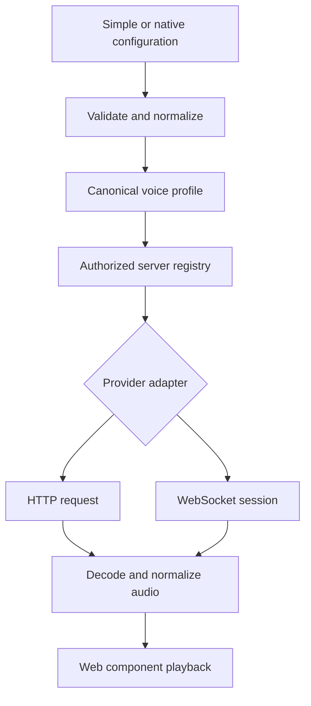

# AI Voice Engineering: Canonical TypeScript Configuration for Natural Speech APIs

**Research date:** 2026-09-08

**Audience:** TypeScript engineers building voice-enabled web components and applications.

**Evidence:** Public API documentation and the earlier naturalness cohort, rechecked for this study. The accompanying code is a documentation-derived reference with offline contract tests. No paid synthesis, account-access checks, listening experiment, or real browser playback test was performed.

## The answer

A canonical configuration is feasible. A reliable implementation needs **a configuration importer, a provider request adapter, and a response/audio adapter**. The web component should call an application endpoint and consume a stable playback contract. Its server translates the selected provider, model and voice into the correct authenticated upstream protocol.

The literal top five from the earlier selection are **Cartesia Sonic 3.6, Inworld TTS 2, Speechify Simba 3.2, Luna TTS, and Inworld TTS 2 Flash**. Four of those rows have verified public request contracts; they require only three provider adapters because both Inworld models share an API. Luna remains representable as catalog metadata, but its complete deployment contract could not be verified. A transformer cannot manufacture the missing API host, model selector or voice catalog. [Prior study](../001-cost-vs-naturalness/README.md), [VUI Labs public API example](https://www.vuilabs.ai/).

For an actionable five-model implementation, this study explicitly replaces the unavailable Luna entry with **Eleven v3 Conversational**, the next model in the earlier cohort with a documented hosted contract after excluding Breeze's separately licensed self-hosting path. That produces five model configurations across four providers. **Google Gemini** is an additional interoperability example, bringing the core comparison to five distinct providers. **OpenAI**, **Smallest AI**, and **Soniox** have companion adapters; OpenAI is included to answer the user's starting configuration, not assigned a fabricated top-ten position.

Read the [ten model profiles and native request examples](providers.md), [TypeScript implementation guide](integrations/README.md), and [source register and unresolved evidence](sources.md).

## Selection and evidence boundaries

This is the **top ten within the previous selection**, ordered by the same voice-preference evidence. It is not a claim to cover today's global top ten: the current leaderboard also includes Qwen and StepFun entries outside that earlier cohort. Elo measures relative listener preference; it does not measure a percentage of human likeness. Nearby confidence intervals overlap. The publisher's listed accent filters are US and UK; these positions do not establish a Portuguese ranking. [Artificial Analysis leaderboard](https://artificialanalysis.ai/text-to-speech/leaderboard/provider-voice).

| Cohort order | Model | Provider | Preference Elo | Public implementation status |
| --- | --- | --- | ---: | --- |
| 1 | Sonic 3.6 | Cartesia | 1282 | Versioned HTTP bytes; SSE and WebSocket alternatives |
| 2 | TTS 2 | Inworld | 1252 | HTTP JSON/base64; streaming alternatives |
| 3 | Simba 3.2 | Speechify | 1240 | HTTP JSON/base64; English-only model |
| 4 | Luna TTS | VUI Labs | 1228 | Partial public example; complete contract unverified |
| 5 | TTS 2 Flash | Inworld | 1222 | Same API as TTS 2; different control capabilities |
| 6 | Breeze TTS 2 | BreezeBlue | 1215 | Documented self-hosted multipart API; license restrictions |
| 7 | Eleven v3 Conversational | ElevenLabs | 1210 | Documented Text-to-Dialogue WebSocket |
| 8 | Gemini 3.1 Flash TTS | Google | 1208 | Preview; explicit API variant required |
| 9 | Lightning v3.1 Pro | Smallest AI | 1190 | HTTP binary audio; model-specific voice pool |
| 10 | TTS Realtime v2 | Soniox | 1179 | Dedicated TTS HTTP host; WebSocket alternative |

The [structured cohort](data/cohort.json) preserves confidence intervals and the observed global position separately. API-status evidence and language details are linked individually in the [profiles](providers.md). Cost does not change this study's ordering. No current price ranking or new cost estimates are implied.

These rows describe the **speech-generation layer**. They are not all LLMs or complete conversational agents. STT, the reasoning model, tool calls, turn detection and memory are separate concerns. Anthropic's model catalog describes text-output models, and its own cookbook combines Claude with external speech services. Consequently, this study does not invent an `anthropic-tts` API. [Anthropic models](https://docs.anthropic.com/en/docs/about-claude/models/overview), [Claude cookbook](https://docs.anthropic.com/en/docs/resources/cookbook).

## Start with the requested configuration style

The original shape is useful as an application-level convenience object:

```ts
import { fromSimple } from './integrations/src/contracts.ts';

const voiceModel = fromSimple({
  provider: 'openai-speech',
  endpoint: '/api/voice/speech',
  profileId: 'openai-marin',
  model: 'gpt-4o-mini-tts',
  voice: 'marin',
});
```

`openai-speech` is our application alias. `/api/voice/speech` is our backend route; the upstream OpenAI path is `/v1/audio/speech`. The model and `marin` voice are documented. Model identity and voice identity are separate: changing the company does not make `marin` a valid voice at another company. [OpenAI speech guide](https://developers.openai.com/api/docs/guides/text-to-speech), [Create speech](https://developers.openai.com/api/reference/resources/audio/subresources/speech/methods/create).

The importer produces this proposed canonical representation:

```ts
const canonical = {
  schemaVersion: 1,
  kind: 'tts',
  profileId: 'openai-marin',
  endpoint: '/api/voice/speech',
  provider: 'openai',
  apiVariant: 'speech',
  model: 'gpt-4o-mini-tts',
  voice: { id: 'marin' },
  delivery: 'buffered',
} as const;
```

`schemaVersion` versions the application contract. `apiVariant` selects a specific provider API family. Neither should be confused with the model version or a provider's dated API header. `profileId` identifies an application-approved server configuration. It is the field the browser sends as authority for selection; the server resolves the actual configuration from its own registry.

The reference accepts a narrow, typed set of provider-specific options. For example, `options.inworld.instruction` is valid only on the full TTS 2 model. Unknown options, an unsupported model/variant, credentials in the public object, and external URLs in `endpoint` are rejected. This is an intentional design decision: silently discarding configuration makes a supposedly portable interface misleading.

## The three transformations



**1. Import configuration.** Convert known identity fields to the canonical object. For example, Inworld's `modelId` and `voiceId` become `model` and `voice.id`. Application fields such as the proxy endpoint cannot be inferred from a provider request; the caller supplies them.

```ts
import { fromNative } from './integrations/src/contracts.ts';

const voiceModel = fromNative(
  'inworld',
  { modelId: 'inworld-tts-2', voiceId: 'Dennis' },
  { profileId: 'inworld-dennis', endpoint: '/api/voice/speech' },
);
```

**2. Create the upstream request.** On the server, `toProviderRequest(config, request, credential)` produces a transport-specific request plan. It owns URLs, authentication, version headers, JSON keys and audio format selection. The caller supplies text and a request ID separately from reusable model configuration. The plan contains credentials and must remain server-side.

**3. Decode and normalize the response.** `synthesize()` executes the request and returns complete audio with explicit metadata. Binary WAV, base64-encoded WAV, base64 PCM and ordered MP3 WebSocket frames require different decoders. Missing audio, abnormal completion, unexpected formats and truncated WAV containers fail rather than becoming a success with an empty file.

The native importer supports the documented minimal **configuration subset**, not arbitrary vendor SDK objects, request bodies or entire realtime sessions. It rejects unmapped fields. A lossless round trip for every vendor feature is outside this contract; new controls require an explicit schema and adapter change.

## What maps cleanly and what does not

| Concern | Canonical representation | Boundary or transformation |
| --- | --- | --- |
| Provider and model | `provider`, `model`, `apiVariant` | Exact provider identity; no silent model substitution |
| Voice selection | `voice.id` | Scoped to provider/catalog/account; no equivalent voice assumed |
| Application routing | `endpoint`, `profileId` | Same-origin backend; server allowlist owns upstream routing |
| Input | Separate `{ text, requestId }` | Request policy is distinct from reusable configuration |
| Locale | Optional `locale` | Map only when supported; reject unimplemented enforcement |
| Style | Namespaced `options` | Different prompts, tags and SSML are not interchangeable |
| Result | Bytes, media type, container, request and model identity | Explicitly decode wrappers; wrap known raw PCM if needed |
| Delivery | `buffered` in the executable reference | A transport may stream upstream while the reference buffers it |
| Cancellation | Abort signal plus playback stop | Provider generation cancellation requires a separate capability |
| Billing | Server-side reservation and provider usage accounting | No universal price-per-minute or cancellation refund assumed |

A generic `speed: 1.2` field would suggest equivalence that is not established. Cartesia exposes speed guidance, Inworld has a different range and model behavior, and Speechify can express controls through SSML. The reference keeps supported controls under their provider namespaces; it does not attempt to convert them into acoustically equivalent speech. [Cartesia controls](https://docs.cartesia.ai/build-with-cartesia/capability-guides/volume-speed-emotion), [Inworld request reference](https://docs.inworld.ai/api-reference/ttsAPI/texttospeech/synthesize-speech), [Speechify speech reference](https://docs.speechify.ai/build/api-reference/v1/audio/speech).

Locale is similarly constrained. The reference rejects non-English locales for Simba 3.2. It rejects explicit locale enforcement for its Google, OpenAI and ElevenLabs implementations because those adapters do not implement such enforcement. That is an **adapter limitation**, not a claim that the models cannot speak other languages. Smallest and Soniox map regional BCP 47 labels to documented base language codes; the selected voice and a language-specific audition must establish the desired regional delivery. [Speechify models](https://docs.speechify.ai/build/guides/concepts/models), [Smallest model card](https://docs.smallest.ai/models/model-cards/text-to-speech/lightning-v-3-1-pro), [Soniox languages](https://soniox.com/docs/tts/concepts/supported-languages).

## Response normalization is as important as input normalization

| Adapter | Verified upstream result used here | Application result |
| --- | --- | --- |
| Cartesia | HTTP audio bytes | WAV bytes |
| Inworld, including Flash | JSON `audioContent` | Base64-decoded WAV bytes |
| Speechify | JSON `audio_data`, `audio_format` | Validate format, then base64-decode WAV |
| ElevenLabs conversational | JSON WebSocket audio frames | Concatenate the one session's ordered MP3 stream; wait for `is_final` |
| Gemini Generate Content | Inline base64 PCM in response parts | Validate completion/metadata, then wrap PCM in WAV |
| OpenAI, Smallest, Soniox | HTTP binary audio | WAV bytes |

This deliberately does **not** promise one identical codec. WAV and MP3 are both represented honestly in `SpeechResult`. A required single codec would add transcoding, CPU cost, latency and an additional validation surface. A shared playback interface does not need to erase that distinction. The preceding provider contracts are documented in the [individual profiles](providers.md).

Google's documented example uses mono, 24 kHz, 16-bit little-endian PCM. The reference checks the expected `audio/L16;codec=pcm;rate=24000` metadata before writing a WAV header. This is container wrapping, not resampling. Its little-endian convention is provider-specific; do not generalize it to every `audio/L16` source. [Google Generate Content speech guide](https://ai.google.dev/gemini-api/docs/generate-content/speech-generation), [Generate Content schema](https://ai.google.dev/api/generate-content).

## Buffered reference versus a realtime extension

Buffering is a deliberate first implementation: it makes complete-file decoding, normal completion and playback ownership straightforward. It delays playback until synthesis completes, so it is **not a demonstrated low-latency conversational solution**. The prototype is suitable for comparing configuration/API boundaries and preparing a later streaming implementation.

For incremental playback, introduce an additional discriminated contract such as the following **proposed interface, not an implemented feature**:

```ts
type SpeechEvent =
  | { type: 'audio-start'; requestId: string; encoding: 'pcm_s16le';
      sampleRateHz: number; channels: 1 }
  | { type: 'audio-chunk'; requestId: string; sequence: number;
      bytes: Uint8Array }
  | { type: 'turn-end'; requestId: string }
  | { type: 'generation-end'; requestId: string }
  | { type: 'error'; requestId: string; code: string };
```

A complete implementation would negotiate an actual supported format, decode each provider's framing, enforce monotonically ordered chunks, bound queues, implement backpressure, resample where necessary and keep generation completion separate from playback completion. `requestId` or a generation counter must prevent audio from an interrupted request reaching the speaker. One JSON parser per network chunk is incorrect for SSE and newline-delimited JSON.

Raw PCM requires a scheduler or AudioWorklet-based playback path, or conversion to complete files. Calling `decodeAudioData()` on arbitrary fragments is not a streaming decoder: the browser API documents complete-file input. [MDN decodeAudioData](https://developer.mozilla.org/en-US/docs/Web/API/BaseAudioContext/decodeAudioData).

Cancellation must distinguish three actions:

1. Stop local playback and clear queued audio immediately.
2. Abort HTTP or close the session transport and discard late output.
3. Invoke provider-specific generation cancellation where documented, without promising a billing refund.

Cartesia supports context cancellation. Soniox has per-stream cancellation and a termination acknowledgment. Inworld `close_context` and ElevenLabs `close_socket` flush pending text; they request completion and must not be used as equivalent cancel messages. [Cartesia WebSocket](https://docs.cartesia.ai/api-reference/tts/websocket), [Soniox WebSocket](https://soniox.com/docs/api-reference/tts/websocket-api), [Inworld WebSocket](https://docs.inworld.ai/api-reference/ttsAPI/texttospeech/synthesize-speech-websocket), [ElevenLabs dialogue guide](https://elevenlabs.io/docs/eleven-api/guides/how-to/websockets/realtime-tdd).

## Web component integration

The host application assigns the canonical object as a JavaScript property. It retains responsibility for selecting an accessible voice, registering the profile on its server and connecting UI events to the player. The component's public contract need not include provider keys, upstream hostnames, provider SDK clients or model-specific response parsers.

```ts
import { SpeechPlayer } from './integrations/src/browser.ts';
import type { VoiceConfig } from './integrations/src/contracts.ts';

class VoiceOutputElement extends HTMLElement {
  voiceModel?: VoiceConfig;
  private audio = new Audio();
  private player = new SpeechPlayer(this.audio);

  connectedCallback() {
    // Recreate after a prior disconnection; the host supplies accessible controls.
    this.player.dispose();
    this.player = new SpeechPlayer(this.audio);
  }

  async speak(text: string) {
    if (!this.voiceModel) throw new Error('Assign voiceModel first');
    await this.player.speak(this.voiceModel, text);
  }

  play() { return this.player.play(); }
  stop() { this.player.stop(); }
  disconnectedCallback() { this.player.dispose(); }
}

customElements.define('voice-output', VoiceOutputElement);
```

This illustrative shell has no visual styling or application-specific state machine. The companion `SpeechPlayer` is type-checked and tested with a fake audio element. Wire `audio-ready`, `playback-started`, `playback-ended` and `playback-blocked` to accessible host controls. A visible Play button should invoke `play()` from a user gesture if autoplay is blocked. The player retains already-generated audio in that case, preventing a new paid synthesis solely to retry playback. [MDN play](https://developer.mozilla.org/en-US/docs/Web/API/HTMLMediaElement/play).

The server handler requires host-provided authorization/quota reservation and credential resolution. It rejects unknown profiles, client-supplied upstream configuration, cross-origin browser requests, oversized input and malformed request IDs. Application authentication, quota settlement, durable idempotency, observability, deployment timeouts and integration-specific disconnect propagation still belong to the host. The included handler is a reference boundary, not a complete billing or authentication product.

## Integration and evaluation decisions

Use the minimal importers and buffered adapters to first verify **the exact provider/model/voice/format combination** in an authenticated environment. Record the API revision, selected voice, locale, request text, runtime, output metadata, error state and completion condition. Test account access and rate limits separately from synthetic fixture tests.

Then evaluate the streaming extension with the same held-out prompts, target language and network conditions. Measure time to first audible sample, end-to-end response time, underruns, interruption-to-silence time, failure rate, complete-word delivery and total billed usage. Include names, numbers, abbreviations, punctuation, short replies, longer passages and multilingual text. Voice naturalness depends on the chosen voice and speaking controls, not only the model label.

Do not split every LLM token into an independent TTS request. A future streaming scheduler should choose text boundaries, retain context where supported and compare prosody and latency empirically. Do not replay requests automatically after partial output without a documented retry policy: the provider may have generated and billed the first attempt. These are engineering recommendations for a future evaluation, not measured findings from this study.

## Verified deliverables and limits

The package includes strict TypeScript source, configuration importers, eight hosted-provider adapters covering nine model configurations, a separate Breeze self-hosted example, a server handler and browser playback helper. The five-model actionable shortlist is contained within those adapters. Luna is documented as a gap and rejected by the executable catalog.

The existing collection validation and ranking calculations remain separate from the new TypeScript compiler and contract tests. Run the commands in the [implementation guide](integrations/README.md). Validation evidence is recorded in [the harness log](../../.agents/evidence/validation.md).

The source snapshot is dated; it does not guarantee future model availability or account entitlements. Audio fixtures verify contracts and lifecycle behavior, not codec fidelity or human naturalness. The source code has no live credentials. No real provider output, Portuguese listening quality, production latency, billing accuracy or actual browser playback has been validated in this research.

## Revision history

| Date | Change |
| --- | --- |
| 2026-09-08 | Initial study: prior ten-model cohort, explicit top-five gap, canonical configuration, native adapters and offline validation. |
